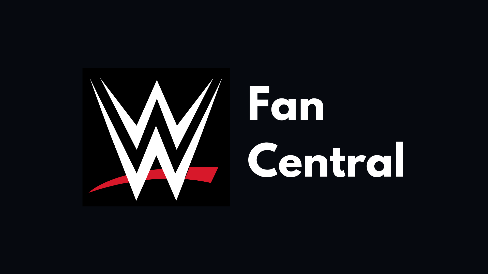

# WWE Fan Central



Welcome to WWE Fan Central! This is a hobby website project dedicated to all things WWE (World Wrestling Entertainment). Whether you're a die-hard wrassling fan or just curious about the world of professional wrestling, this site is for you!

## Features

- **Superstar Profiles**: Learn more about your favorite WWE superstars, their biographies, career highlights, and stats.
- **Match Highlights**: Relive epic moments and watch highlights from my list of memorable matches and events.
- **Event Highlights**: Browse through a collection of stunning photos capturing the action-packed moments from WWE.
- **Interactive Match Simulation**: Create simulation matches with your favourite superstars.

## Technologies Used

- **Frontend**: HTML, CSS, JavaScript
- **Version Control**: Git, GitHub

## Installation

1. Clone the repository:

```bash
git clone https://github.com/SonPhatTranDeveloper/wwe-hobby-website
```

2. Simply open the file ```index.html``` using your favourite browser.

3. Enjoy the content that I created!

## Contributing
Contributions are welcome! If you have ideas for new features, improvements, or bug fixes, feel free to open an issue or submit a pull request. 

## License
This project is licensed under the MIT license (view LICENSE.md for details)